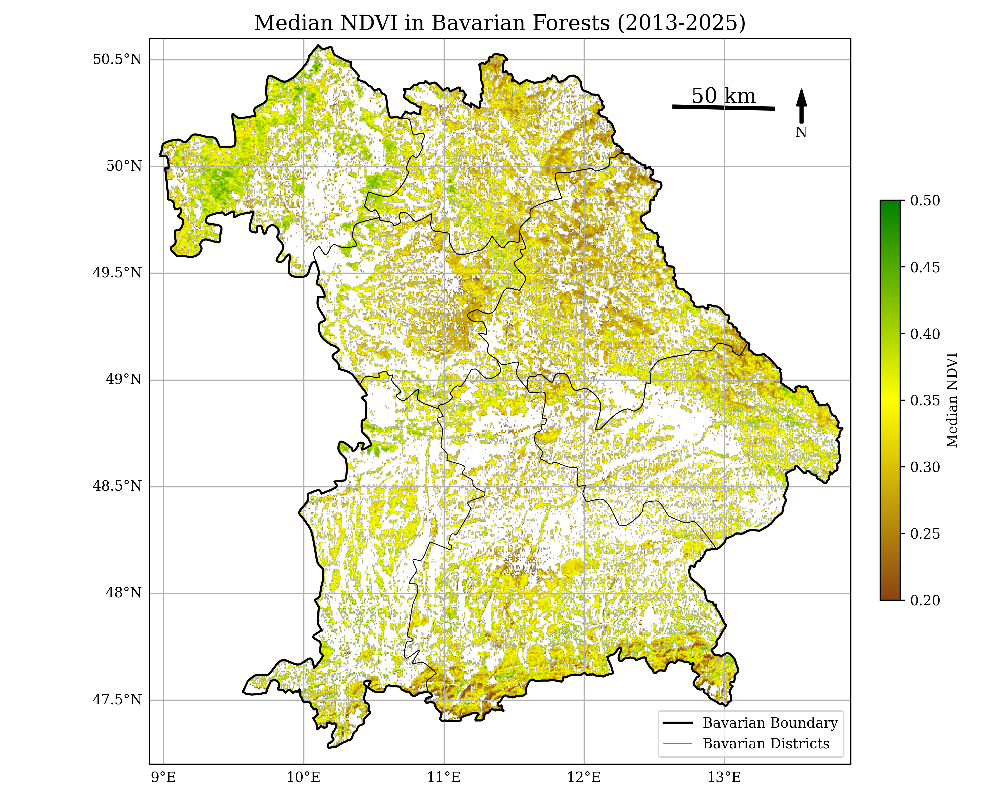
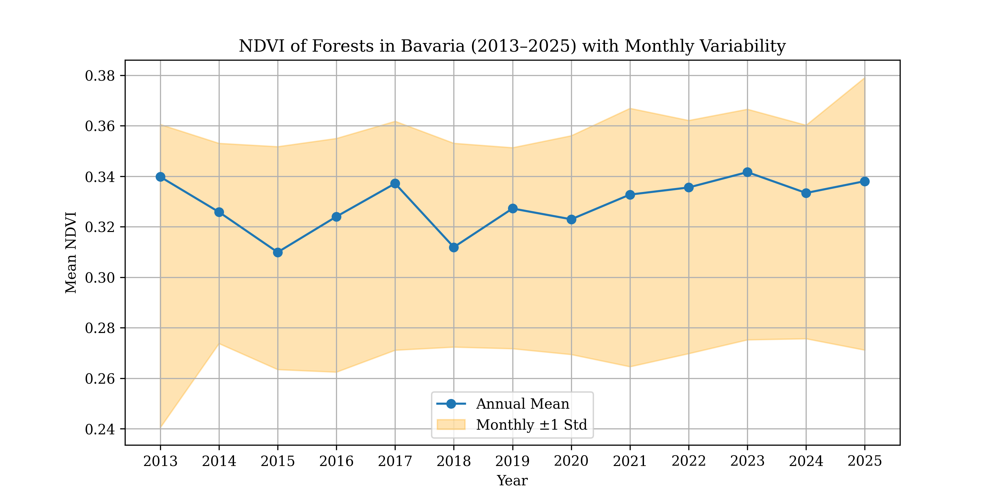
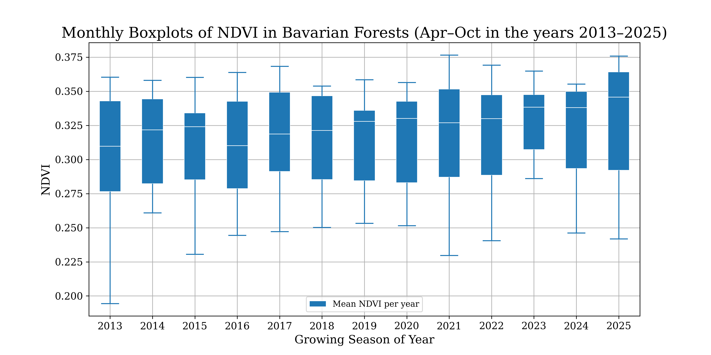

# NDVI Trend Analysis in Bavarian Forests between 2013 and 2025
This repository contains the workflow and results of a pixel-wise NDVI time-series trend analysis of Bavarian forests from 2013 to 2025 based on Landsat 8 satellite imagery.

## Data Sources 
The analysis combines Landsat 8 surface reflectance imagery, administrative boundaries from FAO GAUL 2015, and land cover data from ESA WorldCover 2021 to study forest trends in Bavaria from 2013 to 2025.

| Data Type  | Source/Dataset   | Period/Version      | Notes |
|------------|------------|------------|--------------|
| Satellite Imagery  | Landsat 8 OLI         | 2013 - today  | Surface Reflectance (C2 T1 L2 SR)  |
| Administrative Boundaries  | FAO GAUL 2015       | 2015 | Level 1 = states, Level 2 = districts  |
| Land Cover  | ESA WorldCover 2021        | 2021 | Forest pixels (class 10)  |

## Study Area
The study area encompasses Bavaria, a federal state in southeastern Germany, including all its districts. Forested landscapes were the primary focus for NDVI trend and time-series analyses.

---

## Workflow 

### 1. Data Preparation 
#### 1.1 Import Required Libraries 
#### 1.2 Create Linkage between Python notebook & GEE 
#### 1.3 Load Bavaria Boundary & Districts of Bavaria
#### 1.4 Load Land Cover & Forest Mask
#### 1.5 Load Landsat Collection & Apply Cloud Masking
#### 1.6 Add NDVI Function
### 2. Annual NDVI Composites
#### 2.1 Create Yearly Composites
#### 2.2 Create Maps of Annual NDVI Mean
#### 2.3 Single Median NDVI Map (overall period)
#### 2.4 Timelapse of NDVIs per year
#### 2.5 Monthly NDVI Time Series
##### 2.5.1 Extract monthly and annual NDVIs & convert to pandas dataframe
##### 2.5.2 Plots Monthly NDVI with Annual Mean on top
##### 2.5.3 Boxplots of monthly NDVIs
### 3. Raster Statistics // Pixel-wise Trend Analysis
#### 3.1 NDVI Linear Trend
#### 3.2 Sen´s Slope Trend
### 4. Methodology Description

---

# 1. Data Preparation 
#### 1.1 Import Required Libraries 
```python
# Install necessary packages (run in Colab if not already installed)
!pip install xee
!pip install cartopy
!pip install rioxarray
!pip install geodatasets matplotlib_scalebar 
``` 
These packages are required to access Google Earth Engine (xee, geemap), handle geospatial data (rioxarray, cartopy, geodatasets), and create plots (matplotlib, seaborn).

```python
import ee
import geemap
from geemap import cartoee
import numpy as np
import pandas as pd
import xarray as xr
import matplotlib.pyplot as plt
import matplotlib as mpl
import matplotlib.lines as mlines
import cartopy.crs as ccrs
from cartopy.mpl.geoaxes import GeoAxes
import seaborn as sns
``` 
These imports load Python libraries for geospatial analysis, data processing, visualization, and mapping. ee and geemap provide access to Google Earth Engine; numpy, pandas, and xarray are used for data handling; matplotlib, seaborn, and cartopy are used for plotting and mapping

#### 1.2 Create Linkage between Python notebook & GEE 
``` python
ee.Authenticate()
ee.Initialize(project="propane-tribute-464707-b2")  # link Python notebook to your GEE project
```
This code authenticates your Google Earth Engine (GEE) account and initializes a session, linking the Python notebook to your specific GEE project. It is required before accessing datasets or performing analyses on GEE.

#### 1.3 Load Bavaria Boundary & Districts of Bavaria
In a next step, administrative boundaries for Germany are loaded from the FAO GAUL 2015 dataset, and Bavaria is extracted at both the state (ADM1) and district (ADM2) levels. An interactive map is generated using geemap, displaying Bavaria’s boundaries over a hybrid satellite basemap to provide a visual reference for the study area.
``` python
# Load Germany administrative boundaries (Level 1 = states/provinces)
germany = ee.FeatureCollection("FAO/GAUL/2015/level1") \
  .filter(ee.Filter.eq("ADM0_NAME", "Germany"))

# Extract Bavaria from Germany (ADM1 = state level)
bavaria = germany.filter(ee.Filter.eq("ADM1_NAME", "Bayern"))

# Load Germany districts (Level 2 = smaller administrative units)
germany_level2 = ee.FeatureCollection("FAO/GAUL/2015/level2")
bavaria_districts = germany_level2.filter(ee.Filter.eq("ADM1_NAME", "Bayern"))

# Create an interactive map using geemap
Map = geemap.Map(basemap='HYBRID', ee_initialize=False)  # 'HYBRID' = satellite imagery + labels
Map.addLayer(bavaria, {}, "Bavaria")  # Add Bavaria boundary layer to the map
Map.centerObject(bavaria, 7)
Map
```

Bavaria and its districts are visualized by creating boundary layers, with the state outlined in thicker lines and districts in thinner lines. Both the state and district FeatureCollections are converted to GeoDataFrames to enable plotting and further spatial analysis in Python.
``` python
# Boundaries of Bavaria
bavaria_outline = ee.Image().paint(
    featureCollection=bavaria,
    color=1,
    width=5
).visualize(palette=['black'])

# Boundaries of Districts of Bavaria
districts_outline = ee.Image().paint(
    featureCollection=bavaria_districts,
    color=1,
    width=1
).visualize(palette=['black'])

# Convert EE FeatureCollections to GeoDataFrames for plotting / analysis
bavaria_gdf = geemap.ee_to_gdf(bavaria)
districts_gdf = geemap.ee_to_gdf(bavaria_districts)
```

#### 1.4 Load Land Cover & Forest Mask
Forest pixels (class 10) are extracted from the ESA WorldCover 2021 dataset and clipped to the extent of Bavaria. Non-forest areas are masked, and the resulting forest layer is added to the interactive map for visualization.

``` python
# Load ESA WorldCover 2021 landcover dataset
landcover = ee.Image("ESA/WorldCover/v200/2021")

# Select forest pixels (class 10), clip to Bavaria, mask non-forest areas
forest = landcover.select('Map').eq(10).clip(bavaria).selfMask()

# Add forest layer to the map for visualization
Map.addLayer(forest, {'palette': 'green'}, 'Forest areas')
```


#### 1.5 Load Landsat Collection & Apply Cloud Masking
Cloudy or non-clear pixels are removed from Landsat images by using the QA_PIXEL band. Bit 6 indicates clear pixels, and the function creates a mask to retain only these pixels, improving the quality of the NDVI time-series analysis.
``` python
# Function to mask out cloudy or non-clear pixels using the QA_PIXEL band
def mask_landsat(image):
    qa = image.select("QA_PIXEL")

    # Bit 6 indicates clear pixels (1 = clear); create mask
    mask = qa.bitwiseAnd(1 << 6).neq(0)
    # Apply mask to the image
    return image.updateMask(mask)
```

Landsat 8 Surface Reflectance images are filtered to the Bavaria study area and the time period 2013–2025. The mask_landsat function is applied to remove cloudy or non-clear pixels, ensuring a clean dataset for NDVI computation and pixel-wise trend analysis.
``` python
# Load Landsat 8 Surface Reflectance collection, filter to Bavaria (2013–2025)
# Apply cloud/QA mask to each image
landsat = (ee.ImageCollection("LANDSAT/LC08/C02/T1_L2")
           .filterBounds(bavaria)
           .filterDate('2013-01-01', '2025-10-31')
           .map(mask_landsat))
```

#### 1.6 Add NDVI Function
NDVI (Normalized Difference Vegetation Index) is computed for each Landsat 8 image using the near-infrared (SR_B5) and red (SR_B4) bands. The resulting NDVI is added as a new band to the image, enabling further analysis of vegetation trends across Bavaria.
``` python
# Function to calculate NDVI from Landsat Surface Reflectance bands
def calcNDVI(image):
    ndvi = image.normalizedDifference(['SR_B5', 'SR_B4']).rename('NDVI')  # NDVI = (NIR - Red) / (NIR + Red)
    return image.addBands(ndvi)  # Add NDVI as a new band to the image
```

### 2. Annual NDVI Composites
#### 2.1 Create Yearly Composites
Here, annual NDVI composites are generated for each year from 2013 to 2025 using the growing season (April–October). For each year, NDVI is computed from the filtered Landsat 8 images, median values are taken, non-forest pixels are masked, and the result is clipped to Bavaria. A time band is added to each image to facilitate pixel-wise trend analysis, and all yearly composites are combined into a single ImageCollection.
``` python
# List of years for analysis (2013–2025)
years = list(range(2013, 2026))  # 2025 is included

# Function to create annual NDVI composite for a given year
def create_annual_composite(year):
    # Define growing season (April–October)
    start = ee.Date.fromYMD(year, 4, 1)
    end = ee.Date.fromYMD(year, 10, 31)

    # Filter Landsat images for the year, compute NDVI
    yearly = (landsat
              .filterDate(start, end)
              .map(calcNDVI)
              .select('NDVI'))

    # Create median NDVI composite, mask non-forest pixels, clip to Bavaria
    composite = (yearly.median()
                 .updateMask(forest)  # keep only forest pixels
                 .clip(bavaria)
                 .set('year', year)  # store year metadata
                 .set('system:time_start', start.millis()))

    # Add a 'time' band for trend analysis
    timeBand = ee.Image.constant(year).toFloat().rename('time')

    return composite.addBands(timeBand)

# Combine all yearly composites into a single ImageCollection
annualNDVI = ee.ImageCollection.fromImages([create_annual_composite(y) for y in years])

annualNDVI
```
#### 2.2 Create Maps of Annual NDVI Mean
Yearly median NDVI maps for Bavarian forests (2013–2025) are plotted in a grid layout using Cartopy and matplotlib. Each subplot shows NDVI for a single year, with forest areas highlighted according to a defined color palette. Gridlines, titles, and a horizontal colorbar are added for clarity, and the final figure is saved as a high-resolution PNG.


#### 2.3 Single Median NDVI Map (overall period)
A median NDVI map for Bavarian forests (2013–2025) is created using the annual NDVI composites. Forested areas are visualized with a defined color palette, and both state and district boundaries are overlaid for reference. The map includes a vertical colorbar, north arrow, scale bar, gridlines, and a legend to clearly indicate Bavarian boundaries and districts. The figure is saved as a high-resolution PNG for further use.




#### 2.4 Timelapse of NDVIs per year
An animated timelapse GIF is created to visualize annual NDVI changes in Bavarian forests from 2013 to 2025. Each frame represents a single year, with forested areas colored according to NDVI values. The animation includes a colorbar and year labels, and the resulting GIF is saved for further use and displayed directly in the notebook.

``` python
# Generate NDVI timelapse GIF for Bavarian forests

# Output directory and GIF filename
out_dir = "timelapse"
out_gif = "NDVI_Bavaria_forest.gif"

bavaria_region = [13.9, 47.2, 8.9, 50.6]  # Bounding box for Bavaria

# Visualization parameters for NDVI values
vis_params = {"palette": ['brown', 'yellow', 'green'], "min": 0, "max": 0.5}

# Create animated timelapse of annual NDVI
cartoee.get_image_collection_gif(
    ee_ic=annualNDVI.select('NDVI'),
    out_dir=out_dir,
    out_gif=out_gif,
    vis_params=vis_params,
    region=bavaria_region,
    aspect=1.5,
    fps=3,
    grid_interval=(1, 1),
    plot_title="NDVI - ",
    date_format='YYYY',
    fig_size=(10, 8),
    dpi_plot=300,
    file_format="jpg",
    plot_colorbar=True,
    colorbar_label="NDVI",
    verbose=True,
)

# Display the generated GIF
geemap.show_image(f'{out_dir}/{out_gif}')
```

#### 2.5 Monthly NDVI Time Series
##### 2.5.1 Extract monthly and annual NDVIs & convert to pandas dataframe
Monthly NDVI composites are generated for the growing season (April–October) from 2013 to 2025. For each month, NDVI is computed from Landsat 8 images, median values are calculated, non-forest pixels are masked, and the result is clipped to Bavaria. A time band is added to each image, and all monthly composites are combined into a single ImageCollection for further analysis or visualization.

``` python
# List of months for analysis (April–October)
months = list(range(4, 11))

# Function to create monthly NDVI composite for a given year and month
def create_monthly_composite(year, month):
    start = ee.Date.fromYMD(year, month, 1)
    end = start.advance(1, 'month').advance(-1, 'day')  # handle varying month lengths

    monthly = (landsat
               .filterDate(start, end)
               .map(calcNDVI)
               .select('NDVI'))

    composite = (monthly.median()
                 .updateMask(forest)  # retain only forest pixels
                 .clip(bavaria)
                 .set('year', year)
                 .set('month', month)
                 .set('system:time_start', start.millis()))

    # Add a 'time' band for trend analysis
    timeBand = ee.Image.constant(year + (month-1)/12).toFloat().rename('time')

    return composite.addBands(timeBand)

# Combine all monthly composites into a single ImageCollection
monthly_NDVI = ee.ImageCollection.fromImages(
    [create_monthly_composite(y, m) for y in years for m in months]
)

monthly_NDVI
```

Mean NDVI values are computed for each month across Bavaria using the monthly composites. The results are extracted as features containing the year, month, and mean NDVI, then converted to a Pandas DataFrame for further analysis, plotting, or statistical evaluation.

``` python
# Function to extract mean NDVI for Bavaria from each monthly composite
def extract_monthly_ndvi(image):
    stats = image.reduceRegion(
        reducer=ee.Reducer.mean(),
        geometry=bavaria,
        scale=100,
        maxPixels=1e13
    )
    return ee.Feature(None, {
        'year': image.get('year'),
        'month': image.get('month'),
        'mean_NDVI': stats.get('NDVI')
    })

# Apply the function to all monthly composites
monthly_features = monthly_NDVI.map(extract_monthly_ndvi)

# Convert results to a Pandas DataFrame for analysis
monthly_df = geemap.ee_to_df(ee.FeatureCollection(monthly_features))
```
Mean NDVI values for Bavarian forests are computed for each year from 2013 to 2025. The function calculates the average NDVI across all forest pixels for each annual composite, stores the year and mean NDVI, and the results are converted into a Pandas DataFrame for statistical analysis or plotting trends over time.

``` python
# Function to extract mean NDVI for Bavaria from each annual composite
def extract_ndvi(image):
    stats = image.reduceRegion(
        reducer=ee.Reducer.mean(),      # Compute mean NDVI across all pixels
        geometry=bavaria,
        scale=100,                      # Spatial resolution in meters
        maxPixels=1e13                  # Allow processing of large datasets
    )
    return ee.Feature(None, {
        'year': image.get('year'),      # Store year of composite
        'mean_NDVI': stats.get('NDVI')  # Store mean NDVI
    })

# Apply the function to all annual NDVI composites
meanNDVI = annualNDVI.map(extract_ndvi)

# Extract lists of NDVI values and years
ndvi_values = meanNDVI.aggregate_array('mean_NDVI').getInfo()
date = meanNDVI.aggregate_array('year').getInfo()

# Convert results to a Pandas DataFrame for plotting or further analysis
annual_df = geemap.ee_to_df(ee.FeatureCollection(meanNDVI))
annual_df
```
##### 2.5.2 Plots Monthly NDVI with Annual Mean on top
The plot shows the annual mean NDVI of Bavarian forests from 2013 to 2025 (blue line) along with the monthly variability (shaded orange area representing ±1 standard deviation). This visualization highlights both long-term trends and seasonal fluctuations in forest greenness over the study period.




##### 2.5.3 Boxplots of monthly NDVIs
Monthly NDVI distributions for Bavarian forests (April–October, 2013–2025) are visualized using boxplots. Each box represents the range, median, and spread of NDVI values for a single year, highlighting inter-annual variability and seasonal trends in forest greenness.




### 3. Raster Statistics // Pixel-wise Trend Analysis
#### 3.1 NDVI Linear Trend
Pixel-wise linear trends of NDVI are calculated across Bavaria using the annual NDVI composites. The slope (scale) represents the yearly change in NDVI for each pixel, while the intercept (offset) shows the NDVI at the start of the time series. The resulting trend map is added to the interactive map, with brown indicating decreasing NDVI, yellow stable values, and green increasing NDVI over the period 2013–2025.

``` python
# Calculate pixel-wise NDVI trend over time
# 'time' band = year, 'NDVI' band = annual NDVI
lintrend = annualNDVI.select(['time', 'NDVI']) \
    .reduce(ee.Reducer.linearFit())

# Resulting bands:
# 'scale'  = slope (NDVI change per year)
# 'offset' = intercept (NDVI at time 0)

# Add NDVI trend map to the interactive map
# Brown → decreasing NDVI, Yellow → stable, Green → increasing NDVI
Map.addLayer(
    lintrend.select('scale'),
    {
        'min': -0.01,
        'max': 0.01,
        'palette': ['brown', 'yellow', 'green']
    },
    "NDVI Linear Trend"
)
```
A pixel-wise NDVI linear trend map is created for Bavarian forests (2013–2025) using the annual NDVI composites. The slope (scale) indicates yearly NDVI change per pixel, with negative values showing decreases, near-zero values stable trends, and positive values increases. Forested areas are visualized with a color palette, and state and district boundaries are overlaid for reference. The map includes a colorbar, north arrow, scale bar, gridlines, and a legend, and is saved as a high-resolution PNG.


.png)


#### 3.2 Sen´s Slope Trend
Sen’s Slope, a non-parametric method for linear trend detection, is calculated pixel-wise for Bavarian forests. The annual NDVI collection is reordered so that the first band represents time, and the second NDVI values. The resulting slope map highlights yearly NDVI changes, with brown indicating decreasing forest greenness, yellow stable trends, and green increasing NDVI. The map is added to the interactive viewer for exploration.

``` python
# Sen's Slope requires the independent variable (time/year) as the first band
# Here we reorder bands to [time, NDVI] per image in the collection

def reverseBands(img):
    reversed_bands = img.bandNames().reverse()   # flips band order: [NDVI, year] -> [year, NDVI]
    return img.select(reversed_bands)

# Apply band reordering to entire ImageCollection
trendCol = annualNDVI.map(reverseBands)

# Calculate Sen's Slope per pixel (non-parametric linear trend)
# Slopes indicate NDVI change per year
sens = trendCol.reduce(ee.Reducer.sensSlope())

# Add Sen's Slope map to interactive map
# Color palette: brown = decreasing NDVI, yellow = stable, green = increasing NDVI
Map.addLayer(
    sens.select('slope'),
    {
        'min': -0.002,
        'max': 0.002,
        'palette': ['brown', 'yellow', 'green']
    },
    "Sen Slope NDVI"
)

# Display interactive map
Map
```
Annual mean NDVI values for Bavarian forests (2013–2025) are plotted to visualize trends derived from Sen’s Slope analysis. The line plot shows yearly forest greenness, highlighting increases or decreases over the study period, with markers at each year and a grid for readability. The figure is saved as a high-resolution PNG for further use.


.png)


### 4. Methodology Description


